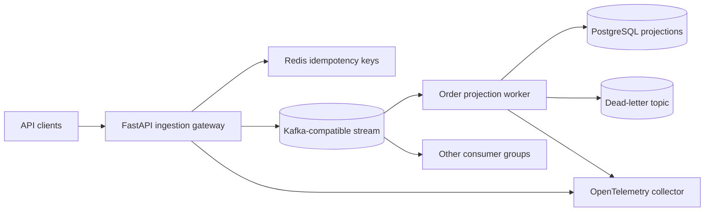

# High-Throughput Event Platform

**Reference architecture for event ingestion, Kafka-style streaming, idempotent workers, retries, DLQ handling, and observable operations.**

This repository demonstrates distributed-systems design choices that often sit underneath production AI, fintech, marketplace, and workflow products: durable ingestion, partitioned streams, at-least-once processing, backpressure-aware workers, and operational evidence.

It is a **reference architecture, not a benchmark claim**. The code and configuration are intentionally inspectable; any throughput numbers should be generated in your own environment with the included load-test harness and published with hardware, partition, payload, and worker details.

## What You Can Inspect

| Engineering question | Where it is shown |
| --- | --- |
| How are duplicate client retries handled? | API idempotency boundary in `app/common/idempotency.py` and ingestion tests |
| How is stream ordering controlled? | `tenant_id:aggregate_id` partition keys in `app/common/partitioning.py` |
| What happens when a worker sees a bad event? | DLQ records in `app/workers/order_projection.py` |
| How are retries bounded? | Exponential backoff policy with jitter in `app/common/retry.py` |
| Where do PostgreSQL, Redis, and Kafka fit? | `docker-compose.yml`, `app/db/schema.sql`, and architecture docs |
| How would this run on Kubernetes? | API and worker manifests in `deploy/kubernetes/` |
| How is observability wired? | FastAPI instrumentation and OpenTelemetry collector config |
| How can load be tested honestly? | k6 smoke profile in `load-tests/k6-ingestion.js` |

## Architecture



## Repository Structure

```text
app/
  api/                  FastAPI ingestion gateway
  common/               event envelope, idempotency, partitioning, retry, telemetry
  db/schema.sql          PostgreSQL tables for events, projections, processed markers, DLQ
  workers/              example projection worker and DLQ behavior
deploy/
  kubernetes/           API and worker deployment manifests
  otel/                 OpenTelemetry collector config
docs/
  adrs/                 architecture decision records
  architecture.md       boundaries, delivery semantics, partition strategy
  reliability.md        retries, lag, DLQ, SLO candidates
  security.md           production security checklist
load-tests/             k6 ingestion smoke profile
tests/                  unit tests for ingestion, partitioning, idempotency, worker behavior
```

## Run the Local API

```bash
python -m venv .venv
. .venv/bin/activate
python -m pip install -e ".[dev]"
uvicorn app.api.main:app --host 127.0.0.1 --port 8000
```

Windows PowerShell:

```powershell
python -m venv .venv
.\.venv\Scripts\python.exe -m pip install -e ".[dev]"
.\.venv\Scripts\python.exe -m uvicorn app.api.main:app --host 127.0.0.1 --port 8000
```

Submit an event:

```bash
curl -X POST http://127.0.0.1:8000/v1/events \
  -H "Content-Type: application/json" \
  -H "X-Trace-Id: demo-trace-1" \
  -d '{
    "tenant_id": "tenant-a",
    "event_type": "order.created",
    "aggregate_id": "order-123",
    "idempotency_key": "demo-request-12345",
    "payload": { "amount": 42 }
  }'
```

The default process uses an in-memory publisher so the API can be inspected without running Kafka. `docker-compose.yml` shows the intended supporting topology with Redpanda, PostgreSQL, Redis, and an OpenTelemetry collector.

## Verify It

```bash
python -m pip install -e ".[dev]"
ruff check .
pytest -q
```

The tests prove the local reference behavior: event validation, stable partition keys, idempotent ingestion, duplicate suppression, worker-side duplicate handling, and DLQ routing for non-recoverable messages.

## Load Testing Without Inflated Claims

Start the API, then run:

```bash
k6 run load-tests/k6-ingestion.js
```

Do not copy numbers from another machine into this README. If you publish results, include:

- CPU, memory, disk, and network context;
- API replica count and worker count;
- partition count;
- payload size and event mix;
- Kafka/PostgreSQL/Redis deployment details;
- p50/p95/p99 latency, error rate, consumer lag, and DLQ rate.

## Design Notes

- **Delivery model:** at-least-once delivery with explicit idempotency at producers and consumers.
- **Partitioning:** `tenant_id:aggregate_id` preserves per-aggregate order while spreading tenants across partitions.
- **Retries:** recoverable failures should use bounded exponential backoff with jitter; poison messages belong in the DLQ.
- **Schema evolution:** event schema versions are part of the envelope; production deployments should add a schema registry and compatibility checks.
- **Observability:** trace IDs flow through the event envelope and OpenTelemetry is wired at the API edge.

## Production Gaps

Before adopting this pattern for real traffic, add authentication, tenant authorization, Redis-backed idempotency, Kafka producer configuration, consumer loops, database transactions around processed-event writes, schema registry checks, dashboards, alerts, signed images, TLS/mTLS, secret rotation, and tested DLQ replay tooling.

## Explore the Decisions

- [Architecture](docs/architecture.md)
- [Reliability and operations](docs/reliability.md)
- [Security considerations](docs/security.md)
- [ADR 0001: Kafka-compatible stream](docs/adrs/0001-use-kafka-compatible-stream.md)
- [ADR 0002: at-least-once delivery with idempotent effects](docs/adrs/0002-idempotency-and-at-least-once-delivery.md)

Built by [Uzair Khatri](https://uzairkhatri.com). Licensed under [MIT](LICENSE).

