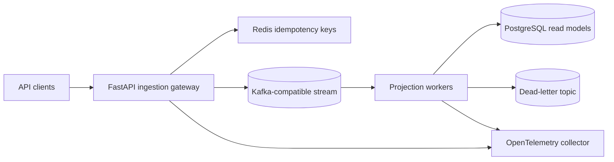

# Architecture

This repository models an event ingestion platform that accepts externally supplied
business events, assigns them to stable stream partitions, and processes them with
independent workers.

## Boundaries

| Boundary | Responsibility |
| --- | --- |
| API gateway | Validate shape, enforce payload limits, create trace IDs, reserve idempotency keys, publish events |
| Event stream | Preserve per-key ordering and decouple ingestion rate from processing rate |
| Workers | Apply business logic, keep consumer-side idempotency, retry recoverable failures, dead-letter poison messages |
| PostgreSQL | Store projections and auditable processing state |
| Redis | Share idempotency reservations across API replicas |
| OpenTelemetry | Correlate API and worker spans through trace IDs |

## Partitioning

Events use `tenant_id:aggregate_id` as the partition key. This preserves ordering
for one aggregate inside one tenant without forcing all tenant traffic through one
hot partition. High-volume tenants may still need key salting for event types that
do not require strict per-aggregate order.

## Delivery Semantics

The implemented Docker runtime uses at-least-once delivery with explicit idempotency:

- producer-side idempotency rejects duplicate client requests with the original `event_id`;
- stream delivery may replay events;
- workers insert processed `event_id` values in the same PostgreSQL transaction as projection updates;
- non-recoverable messages are moved to a DLQ with error metadata.

Kafka offsets are committed only after the projection succeeds, a duplicate is recognized, or the DLQ publish is acknowledged. Unexpected infrastructure failures leave the offset uncommitted for redelivery.

## What Is Deliberately Omitted

This is a reference architecture, not a managed production platform. It does not
include multi-region replication, schema registry enforcement, Kafka ACL setup,
DLQ replay, backfill tooling, autoscaling policies, or dashboards. The repository shows where
those controls belong and includes enough code and configuration to inspect the
system design.

